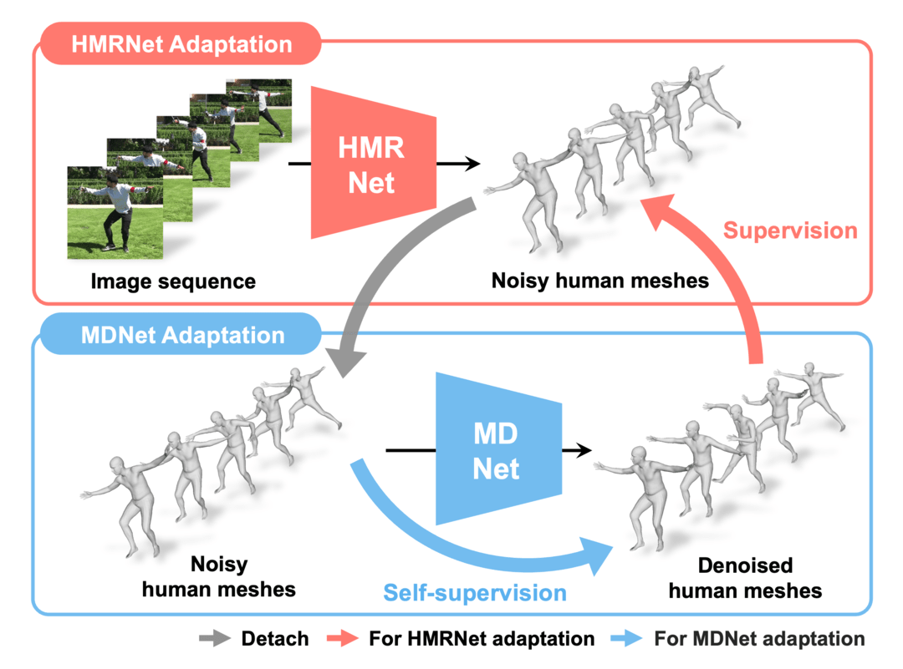
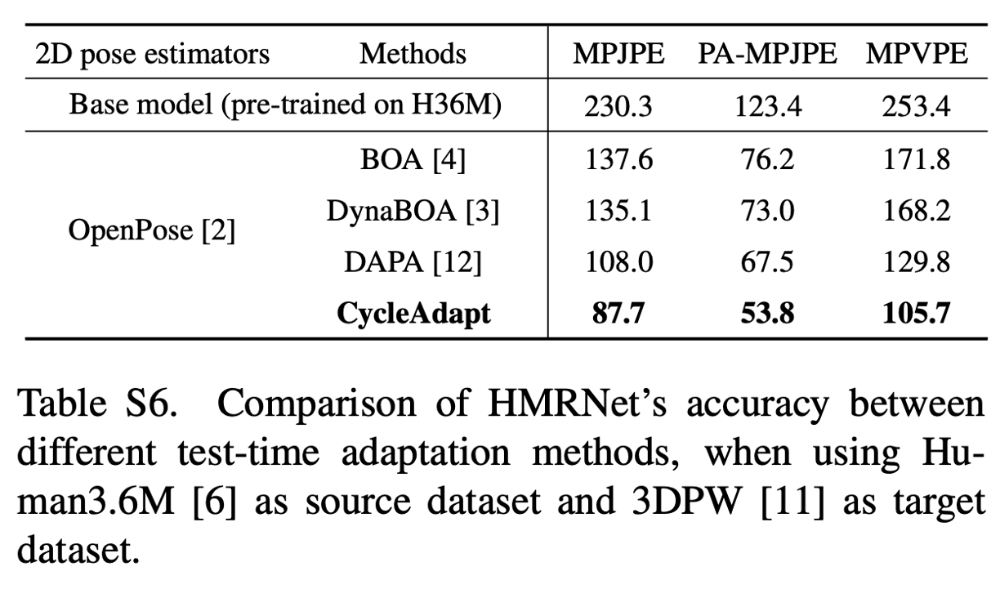

# **Cyclic Test-Time Adaptation on Monocular Video for 3D Human Mesh Reconstruction (CycleAdapt codes)**

> [**Cyclic Test-Time Adaptation on Monocular Video for 3D Human Mesh Reconstruction**](https://arxiv.org/abs/2308.06554),            
> Hyeongjin Nam,
> Daniel Sungho Jung,
> Yeonguk Oh,
> Kyoung Mu Lee,        
> *International Conference on Computer Vision (ICCV), 2023*

<p align="center">  
  
</p> 
<p align="center">  
  
</p> 

## Installation
* We recommend you to use an [Anaconda](https://www.anaconda.com/) virtual environment. Install PyTorch >=1.8.0 and Python >= 3.7.0. 
* Then, run `pip install -r requirements.txt`. You should slightly change `torchgeometry` kernel code following [here](https://github.com/mks0601/I2L-MeshNet_RELEASE/issues/6#issuecomment-675152527).


## Quick demo
* Prepare `data/base_data` folder following below [`Directory`](./asset/directory.md/#required-data) part.
* Download [demo files](https://drive.google.com/file/d/1hPBujCx2F4xC5_8iiorkGePo1r7ac425/view?usp=sharing) and place them into `data/Demo`.
* To run CycleAdapt on a custom video, please refer [here](./asset/directory.md/#demo).
* Run `python main/adapt.py --gpu 0 --cfg asset/yaml/demo.yml`.


## Directory
Refer to [here](./asset/directory.md).


## Running CycleAdapt

In the `asset/yaml/*.yml`, you can change datasets and settings to use.

Run
```
python main/adapt.py  --gpu 0 --cfg asset/yaml/3dpw.yml
``` 

To evaluate the adapted models in your experiment folder, run
``` 
python main/test.py --gpu 0 --cfg asset/yaml/3dpw.yml --exp-dir {exp_path}
``` 


## Result
Refer to the [paper](https://arxiv.org/abs/2308.06554)'s main manuscript and supplementary material for diverse qualitative results.

<p align="center">  
  
</p> 

## Reference  
```  
@InProceedings{Nam_2023_ICCV_CycleAdapt,  
author = {Nam, Hyeongjin and Jung, Daniel Sungho and Oh, Yeonguk and Lee, Kyoung Mu},  
title = {Cyclic Test-Time Adaptation on Monocular Video for 3D Human Mesh Reconstruction},  
booktitle = {International Conference on Computer Vision (ICCV)},  
year = {2023}  
}  
```
